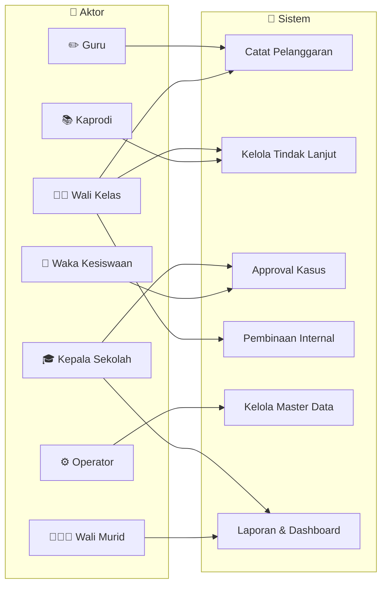
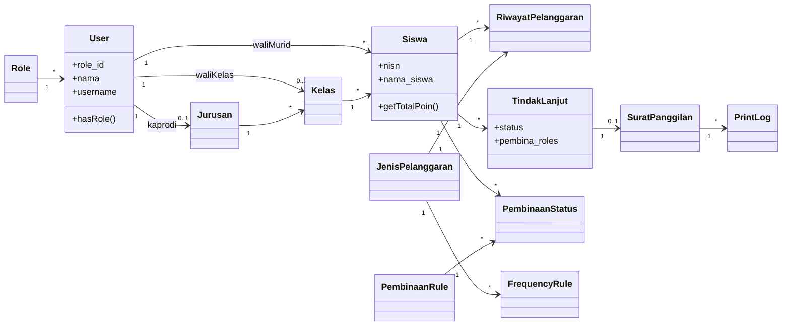
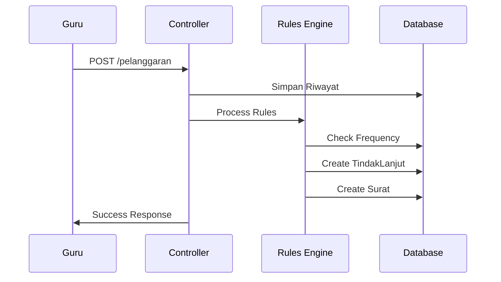
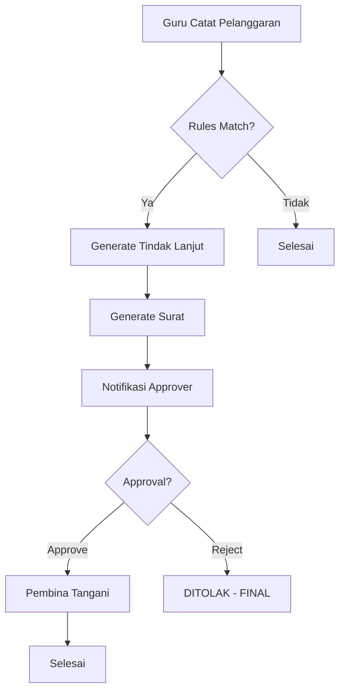
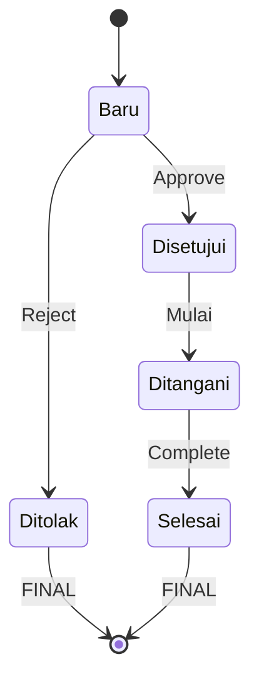
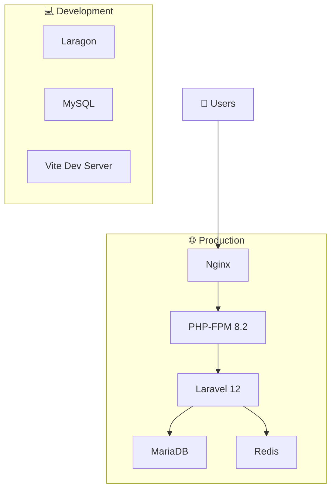
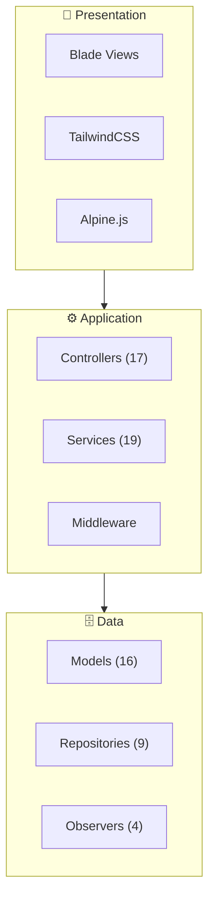

# 🏗️ ARSITEKTUR SISTEM

## Sistem Informasi Kedisiplinan Siswa SMK Negeri 1

**Versi:** 1.0  
**Framework:** Laravel 12  
**Terakhir Diupdate:** 27 Desember 2024

---

## 📋 Daftar Isi

1. [Ringkasan Sistem](#ringkasan-sistem)
2. [Diagram UML](#diagram-uml)
    - [Use Case Diagram](#1-use-case-diagram)
    - [Class Diagram](#2-class-diagram)
    - [Sequence Diagram](#3-sequence-diagram)
    - [Activity Diagram](#4-activity-diagram)
    - [State Diagram](#5-state-diagram)
    - [Deployment Diagram](#6-deployment-diagram)
    - [Component Diagram](#7-component-diagram)
3. [Technology Stack](#technology-stack)
4. [Quick Reference](#quick-reference)

---

## 📖 Ringkasan Sistem

Sistem Informasi Kedisiplinan Siswa adalah aplikasi web untuk mengelola:

-   📝 **Pencatatan Pelanggaran** - Guru mencatat pelanggaran siswa
-   ⚙️ **Frequency Rules** - Aturan otomatis berdasarkan frekuensi pelanggaran
-   📋 **Tindak Lanjut** - Workflow penanganan kasus dengan approval
-   📄 **Surat Panggilan** - Generate PDF surat panggilan orang tua
-   🎓 **Pembinaan Internal** - Tracking pembinaan berdasarkan akumulasi poin
-   📊 **Dashboard & Laporan** - Statistik dan reporting per role

---

## 📊 Diagram UML

### 1. Use Case Diagram

📄 **File:** [`diagrams/01_usecase.md`](diagrams/01_usecase.md)

Menggambarkan interaksi antara 8 aktor dengan fungsionalitas sistem.



| Aktor          | Hak Akses Utama                   |
| -------------- | --------------------------------- |
| Kepala Sekolah | Approval final, Dashboard sekolah |
| Waka Kesiswaan | Approval, Dashboard admin         |
| Kaprodi        | Penanganan kasus jurusan          |
| Wali Kelas     | Penanganan kasus kelas            |
| Guru           | Catat pelanggaran                 |
| Operator       | Master data, Settings             |
| Wali Murid     | Monitoring anak                   |

---

### 2. Class Diagram

📄 **File:** [`diagrams/02_class.md`](diagrams/02_class.md)

Menggambarkan 16 Eloquent Models dan relasinya.



| Model           | Tabel            | Relasi   |
| --------------- | ---------------- | -------- |
| User            | users            | 8 relasi |
| Siswa           | siswa            | 4 relasi |
| TindakLanjut    | tindak_lanjut    | 5 relasi |
| SuratPanggilan  | surat_panggilan  | 2 relasi |
| PembinaanStatus | pembinaan_status | 4 relasi |

---

### 3. Sequence Diagram

📄 **File:** [`diagrams/03_sequence.md`](diagrams/03_sequence.md)

Menggambarkan alur interaksi untuk proses-proses utama.



| Proses            | Deskripsi              |
| ----------------- | ---------------------- |
| Login             | Role-based redirect    |
| Catat Pelanggaran | Trigger rules otomatis |
| Approval          | Workflow persetujuan   |
| Cetak Surat       | PDF generation         |
| Pembinaan         | Tracking status        |

---

### 4. Activity Diagram

📄 **File:** [`diagrams/04_activity.md`](diagrams/04_activity.md)

Menggambarkan workflow proses-proses bisnis.



| Aktivitas         | Swimlane           |
| ----------------- | ------------------ |
| Login             | User, Sistem       |
| Catat Pelanggaran | Guru, Rules Engine |
| Approval          | Pembina, Approver  |
| Pembinaan         | Multi-actor        |

---

### 5. State Diagram

📄 **File:** [`diagrams/05_state.md`](diagrams/05_state.md)

Menggambarkan state transitions untuk entitas kunci.



| Entitas         | States                                                   |
| --------------- | -------------------------------------------------------- |
| TindakLanjut    | 4 (Baru → Disetujui → Ditangani → Selesai, atau Ditolak) |
| PembinaanStatus | 3 (Perlu → Sedang → Selesai)                             |
| Siswa           | 2 (Aktif ↔ Tidak Aktif)                                  |
| User            | 2 (Aktif ↔ Tidak Aktif)                                  |

---

### 6. Deployment Diagram

📄 **File:** [`diagrams/06_deployment.md`](diagrams/06_deployment.md)

Arsitektur deployment untuk berbagai environment.



| Environment | Stack                          |
| ----------- | ------------------------------ |
| Development | Laragon, MySQL, Vite           |
| Production  | Nginx, PHP-FPM, MariaDB, Redis |
| Shared Host | LiteSpeed, MySQL               |

---

### 7. Component Diagram

📄 **File:** [`diagrams/07_component.md`](diagrams/07_component.md)

Struktur komponen aplikasi Laravel.



| Layer        | Komponen     | Jumlah |
| ------------ | ------------ | ------ |
| Presentation | Blade Views  | 50+    |
| Application  | Controllers  | 17     |
| Application  | Services     | 19     |
| Data         | Models       | 16     |
| Data         | Repositories | 9      |
| Data         | Observers    | 4      |

---

## 🛠️ Technology Stack

### Backend

| Teknologi     | Versi     | Fungsi          |
| ------------- | --------- | --------------- |
| PHP           | ^8.2      | Runtime         |
| Laravel       | ^12.0     | Framework       |
| MySQL/MariaDB | 8.0/10.11 | Database        |
| Redis         | Latest    | Cache & Session |

### Frontend

| Teknologi    | Versi   | Fungsi        |
| ------------ | ------- | ------------- |
| TailwindCSS  | ^4.1.17 | Styling       |
| Alpine.js    | ^3.15.2 | Interactivity |
| Vite         | ^7.0.7  | Bundler       |
| Lucide Icons | ^1.24   | Icons         |

### Packages

| Package                    | Versi | Fungsi         |
| -------------------------- | ----- | -------------- |
| barryvdh/laravel-dompdf    | ^3.1  | PDF Generation |
| spatie/laravel-activitylog | ^4.10 | Audit Trail    |
| spatie/laravel-data        | ^4.18 | DTOs           |

---

## 📚 Quick Reference

### Struktur Folder Diagram

```
docs/
├── ARCHITECTURE.md              ← File ini
├── VERIFICATION_REPORT.md       ← Laporan verifikasi
│
├── diagrams/                    ← Mermaid.js Diagrams
│   ├── 01_usecase.md
│   ├── 02_class.md
│   ├── 03_sequence.md
│   ├── 04_activity.md
│   ├── 05_state.md
│   ├── 06_deployment.md
│   └── 07_component.md
│
└── plantuml/                    ← PlantUML Diagrams (Industrial Grade)
    ├── README.md                ← Panduan render
    ├── 01_usecase_v2.puml
    ├── 02_class_v2.puml
    ├── 03_sequence_*.puml       ← 3 sequence diagrams
    ├── 04_activity_*.puml       ← 3 activity diagrams
    ├── 05_state_*.puml          ← 3 state diagrams
    ├── 06_deployment_v2.puml
    ├── 07_component_v2.puml
    │
    └── flowcharts/              ← Flowcharts (Activity Diagrams)
        ├── README.md            ← Panduan export SVG
        ├── flowchart_pencatatan.puml
        ├── flowchart_approval.puml
        └── flowchart_pembinaan.puml
```

### Cara Melihat Diagram

#### Mermaid.js (folder diagrams/)

1. **VS Code**: Install extension "Markdown Preview Mermaid Support"
2. **GitHub**: Mermaid auto-render di GitHub markdown
3. **Online**: Paste ke [mermaid.live](https://mermaid.live)

#### PlantUML (folder plantuml/) - **RECOMMENDED**

1. **VS Code**: Install extension "PlantUML" by jebbs
    - Tekan `Alt + D` untuk preview
    - `Ctrl + Shift + P` → "PlantUML: Export Current Diagram"
2. **Command Line**:
    ```bash
    java -jar plantuml.jar docs/plantuml/*.puml
    ```
3. **Online**: Paste ke [plantuml.com](https://www.plantuml.com/plantuml)

### Export ke SVG untuk Laporan

**SVG direkomendasikan karena:**

-   ✅ Tidak pecah/blur saat di-zoom
-   ✅ Scalable untuk berbagai ukuran
-   ✅ Ukuran file kecil

**Command Line:**

```bash
# Export semua diagram ke SVG
java -jar plantuml.jar -tsvg docs/plantuml/*.puml
java -jar plantuml.jar -tsvg docs/plantuml/flowcharts/*.puml

# Export ke PNG dengan high resolution
java -jar plantuml.jar -tpng -Sdpi=300 docs/plantuml/flowcharts/*.puml
```

**VS Code:**

1. Buka file `.puml`
2. `Ctrl + Shift + P` → "PlantUML: Export Current Diagram"
3. Pilih format: **SVG** (recommended) atau **PNG**

### Status Enum Values

**StatusTindakLanjut:**

```
Baru → Menunggu Persetujuan → Disetujui → Ditangani → Selesai
                           ↘ Ditolak ↗
```

**StatusPembinaan:**

```
Perlu Pembinaan → Sedang Dibina → Selesai
```

---

## 📝 Catatan

-   **Mermaid.js**: Diagram ringan untuk preview cepat di GitHub/VS Code
-   **PlantUML**: Diagram industrial-grade dengan styling profesional (RECOMMENDED)
-   Semua diagram konsisten dengan struktur **Laravel 12**
-   Nama model/tabel sesuai dengan source code aktual

### PlantUML Features

-   ✅ Proper UML notation dengan stick figures untuk actors
-   ✅ Professional styling dengan skinparam
-   ✅ Visibility markers (+, -, #)
-   ✅ Autonumber untuk sequence diagrams
-   ✅ Box grouping untuk komponen
-   ✅ Notes dan legends

---

**Dibuat dengan ❤️ untuk SMK Negeri 1**  
**Dokumentasi ini adalah bagian dari Sistem Informasi Kedisiplinan Siswa**  
**Versi PlantUML: 2.0 (27 Desember 2024)**
