# 📋 Use Case Diagram

## Sistem Informasi Kedisiplinan Siswa SMK Negeri 1

### Deskripsi

Use Case Diagram menggambarkan interaksi antara aktor (pengguna) dengan sistem, menunjukkan fungsionalitas utama yang disediakan.

---

## Diagram Utama: Sistem Kedisiplinan

> **Catatan:** Mermaid.js tidak memiliki tipe `useCaseDiagram` native. Diagram di bawah menggunakan `flowchart` dengan representasi visual yang mendekati UML Use Case standard.

### Diagram dengan Stick Figure Representation

```mermaid
flowchart LR
    %% === AKTOR (Stick Figures) ===
    subgraph Actors_Left[""]
        direction TB
        A1(("👤"))
        A1_name["Kepala Sekolah"]
        A2(("👤"))
        A2_name["Waka Kesiswaan"]
        A3(("👤"))
        A3_name["Kaprodi"]
        A4(("👤"))
        A4_name["Wali Kelas"]
    end

    subgraph Actors_Right[""]
        direction TB
        A5(("👤"))
        A5_name["Guru"]
        A6(("👤"))
        A6_name["Operator"]
        A7(("👤"))
        A7_name["Wali Murid"]
        A8(("👤"))
        A8_name["Waka Sarana"]
    end

    subgraph System["🏫 SISTEM KEDISIPLINAN SISWA"]
        direction TB

        UC1([Login])
        UC2([Catat Pelanggaran])
        UC3([Lihat Riwayat])
        UC4([Approve Tindak Lanjut])
        UC5([Tangani Kasus])
        UC6([Cetak Surat])
        UC7([Kelola Pembinaan])
        UC8([Kelola Master Data])
        UC9([Kelola Rules])
        UC10([Lihat Dashboard])
        UC11([Export Laporan])
    end

    %% Koneksi Kepala Sekolah
    A1 --> UC1
    A1 --> UC4
    A1 --> UC10
    A1 --> UC11

    %% Koneksi Waka Kesiswaan
    A2 --> UC1
    A2 --> UC3
    A2 --> UC4
    A2 --> UC6
    A2 --> UC10

    %% Koneksi Kaprodi
    A3 --> UC1
    A3 --> UC2
    A3 --> UC5
    A3 --> UC7
    A3 --> UC10

    %% Koneksi Wali Kelas
    A4 --> UC1
    A4 --> UC2
    A4 --> UC5
    A4 --> UC6
    A4 --> UC7
    A4 --> UC10

    %% Koneksi Guru
    A5 --> UC1
    A5 --> UC2
    A5 --> UC3

    %% Koneksi Operator
    A6 --> UC1
    A6 --> UC8
    A6 --> UC9

    %% Koneksi Wali Murid
    A7 --> UC1
    A7 --> UC3
    A7 --> UC10

    %% Koneksi Waka Sarana
    A8 --> UC1
    A8 --> UC3
    A8 --> UC10
```

---

### Diagram Detail per Kategori Use Case


---

### Legenda Diagram

```mermaid
flowchart LR
    subgraph Legend["📋 LEGENDA UML USE CASE"]
        Actor(("👤")) --- ActorLabel["Aktor (Pengguna)"]
        UseCase(["Use Case"]) --- UCLabel["Fungsionalitas Sistem"]
        Rectangle["System Boundary"] --- SysLabel["Batas Sistem"]
    end

    subgraph Relationships["🔗 RELASI"]
        R1["───"] --- R1L["Association (Aktor ke Use Case)"]
        R2["- - - -"] --- R2L["Include/Extend (antar Use Case)"]
    end
```



---

## Matriks Aktor vs Use Case

```mermaid
%%{init: {'theme': 'base', 'themeVariables': {'fontSize': '12px'}}}%%
flowchart LR
    subgraph Legend["📑 LEGENDA"]
        L1["✅ = Akses Penuh"]
        L2["👁️ = Hanya Lihat"]
        L3["❌ = Tidak Ada Akses"]
    end
```



| Use Case              | Kepsek | Waka | Kaprodi | WaliKelas | Guru | Operator | WaliMurid |
| --------------------- | ------ | ---- | ------- | --------- | ---- | -------- | --------- |
| Login                 | ✅     | ✅   | ✅      | ✅        | ✅   | ✅       | ✅        |
| Catat Pelanggaran     | ❌     | ✅   | ✅      | ✅        | ✅   | ❌       | ❌        |
| Lihat Riwayat         | ✅     | ✅   | ✅      | ✅        | 👁️   | ✅       | 👁️        |
| Approve Tindak Lanjut | ✅     | ✅   | ❌      | ❌        | ❌   | ❌       | ❌        |
| Cetak Surat           | ❌     | ✅   | ✅      | ✅        | ❌   | ❌       | ❌        |
| Kelola Master Data    | ❌     | ❌   | ❌      | ❌        | ❌   | ✅       | ❌        |
| Kelola Rules          | ❌     | ❌   | ❌      | ❌        | ❌   | ✅       | ❌        |
| Lihat Dashboard       | ✅     | ✅   | ✅      | ✅        | ❌   | ✅       | ✅        |

---

## Use Case Detail: Catat Pelanggaran

```mermaid
flowchart TD
    subgraph UC_CatatPelanggaran["📝 Use Case: Catat Pelanggaran"]
        Start((🔵 Start))
        A["Guru membuka form catat pelanggaran"]
        B["Pilih/Cari siswa"]
        C["Pilih jenis pelanggaran"]
        D{"Jenis memiliki\nFrequency Rules?"}
        E["Sistem hitung frekuensi ke-N"]
        F["Sistem ambil poin dari rules"]
        G["Input keterangan & bukti foto"]
        H["Submit pelanggaran"]
        I["Sistem simpan riwayat"]
        J{"Trigger\nTindak Lanjut?"}
        K["Auto-generate Tindak Lanjut"]
        L["Auto-generate Surat Panggilan"]
        M["Notifikasi ke Pembina"]
        End((🔴 End))

        Start --> A
        A --> B
        B --> C
        C --> D
        D -->|Ya| E
        D -->|Tidak| G
        E --> F
        F --> G
        G --> H
        H --> I
        I --> J
        J -->|Ya| K
        J -->|Tidak| End
        K --> L
        L --> M
        M --> End
    end
```



---

## Use Case Detail: Approval Workflow

```mermaid
flowchart TD
    subgraph UC_Approval["✅ Use Case: Approval Tindak Lanjut"]
        Start((🔵))
        A["Pembina submit kasus ke approval"]
        B["Notifikasi ke Approver"]
        C["Approver review kasus"]
        D{"Keputusan?"}
        E["Set status = Disetujui"]
        F["Set status = Ditolak"]
        G["Input alasan penolakan"]
        H["Notifikasi ke Pembina"]
        I["Pembina dapat melanjutkan penanganan"]
        J["Pembina harus revisi"]
        End((🔴))

        Start --> A
        A --> B
        B --> C
        C --> D
        D -->|Approve| E
        D -->|Reject| F
        E --> H
        F --> G
        G --> H
        H --> I
        H --> J
        I --> End
        J --> A
    end
```



---

**Dokumen ini menggunakan sintaks Mermaid.js**  
**Terakhir diupdate: 27 Desember 2024**
