# 📊 Class Diagram
## Sistem Informasi Kedisiplinan Siswa SMK Negeri 1

### Deskripsi
Class Diagram menggambarkan struktur data sistem menggunakan Eloquent Models dalam Laravel 12, termasuk atribut, method, dan relasi antar model.

---

## Diagram Lengkap: Semua Model

```mermaid
classDiagram
    direction TB
    
    %% ==================== USER & ROLE ====================
    class Role {
        +bigint id
        +string nama_role
        --
        +users() HasMany~User~
        +findByName(string) Role
    }
    
    class User {
        +bigint id
        +bigint role_id
        +string nama
        +string username
        +string email
        +string password
        +string phone
        +string nip
        +string nuptk
        +boolean is_active
        +timestamp last_login_at
        --
        +role() BelongsTo~Role~
        +jurusanDiampu() HasOne~Jurusan~
        +kelasDiampu() HasOne~Kelas~
        +anakWali() HasMany~Siswa~
        +riwayatDicatat() HasMany~RiwayatPelanggaran~
        +tindakLanjutDisetujui() HasMany~TindakLanjut~
        +hasRole(string) bool
        +isTeacher() bool
        +isWaliKelas() bool
        +isKaprodi() bool
        +canViewStudent(Siswa) bool
    }
    
    Role "1" --> "*" User : has
    
    %% ==================== STRUKTUR SEKOLAH ====================
    class Jurusan {
        +bigint id
        +bigint kaprodi_user_id
        +string nama_jurusan
        +string kode_jurusan
        --
        +kaprodi() BelongsTo~User~
        +kelas() HasMany~Kelas~
        +siswa() HasManyThrough~Siswa~
    }
    
    class Kelas {
        +bigint id
        +bigint jurusan_id
        +bigint wali_kelas_user_id
        +string nama_kelas
        +string tingkat
        --
        +jurusan() BelongsTo~Jurusan~
        +waliKelas() BelongsTo~User~
        +siswa() HasMany~Siswa~
    }
    
    class Siswa {
        +bigint id
        +bigint kelas_id
        +bigint wali_murid_user_id
        +string nisn
        +string nama_siswa
        +string nomor_hp_wali_murid
        +string alasan_keluar
        +timestamp deleted_at
        --
        +kelas() BelongsTo~Kelas~
        +waliMurid() BelongsTo~User~
        +riwayatPelanggaran() HasMany~RiwayatPelanggaran~
        +tindakLanjut() HasMany~TindakLanjut~
        +getTotalPoinAttribute() int
    }
    
    User "1" --> "0..1" Jurusan : kaprodi
    User "1" --> "0..1" Kelas : waliKelas
    User "1" --> "*" Siswa : waliMurid
    Jurusan "1" --> "*" Kelas : has
    Kelas "1" --> "*" Siswa : has
    
    %% ==================== PELANGGARAN ====================
    class KategoriPelanggaran {
        +bigint id
        +string nama_kategori
        +enum tingkat_keseriusan
        --
        +jenisPelanggaran() HasMany~JenisPelanggaran~
        +getColorAttribute() string
        +getIconAttribute() string
    }
    
    class JenisPelanggaran {
        +bigint id
        +bigint kategori_id
        +string nama_pelanggaran
        +int poin
        +boolean has_frequency_rules
        +boolean is_active
        +string filter_category
        +string keywords
        --
        +kategoriPelanggaran() BelongsTo~KategoriPelanggaran~
        +riwayatPelanggaran() HasMany~RiwayatPelanggaran~
        +frequencyRules() HasMany~PelanggaranFrequencyRule~
        +usesFrequencyRules() bool
        +getDisplayPoin() string
        +isRecordable() bool
    }
    
    class PelanggaranFrequencyRule {
        +bigint id
        +bigint jenis_pelanggaran_id
        +int frequency_min
        +int frequency_max
        +int poin
        +text sanksi_description
        +boolean trigger_surat
        +json pembina_roles
        +int display_order
        --
        +jenisPelanggaran() BelongsTo~JenisPelanggaran~
        +matchesFrequency(int) bool
        +getSuratType() string
    }
    
    class RiwayatPelanggaran {
        +bigint id
        +bigint siswa_id
        +bigint jenis_pelanggaran_id
        +bigint guru_pencatat_user_id
        +date tanggal_kejadian
        +text keterangan
        +string bukti_foto_path
        +timestamp deleted_at
        --
        +siswa() BelongsTo~Siswa~
        +jenisPelanggaran() BelongsTo~JenisPelanggaran~
        +guruPencatat() BelongsTo~User~
    }
    
    KategoriPelanggaran "1" --> "*" JenisPelanggaran : has
    JenisPelanggaran "1" --> "*" PelanggaranFrequencyRule : has
    JenisPelanggaran "1" --> "*" RiwayatPelanggaran : recorded
    Siswa "1" --> "*" RiwayatPelanggaran : has
    User "1" --> "*" RiwayatPelanggaran : records
    
    %% ==================== TINDAK LANJUT ====================
    class TindakLanjut {
        +bigint id
        +bigint siswa_id
        +text pemicu
        +text sanksi_deskripsi
        +json pembina_roles
        +text denda_deskripsi
        +enum status
        +date tanggal_tindak_lanjut
        +bigint penyetuju_user_id
        +bigint ditangani_oleh_user_id
        +timestamp ditangani_at
        +bigint diselesaikan_oleh_user_id
        +timestamp diselesaikan_at
        --
        +siswa() BelongsTo~Siswa~
        +penyetuju() BelongsTo~User~
        +suratPanggilan() HasOne~SuratPanggilan~
        +ditanganiOleh() BelongsTo~User~
        +diselesaikanOleh() BelongsTo~User~
        +scopePendingApproval() Builder
        +scopeForPembina(string) Builder
    }
    
    class SuratPanggilan {
        +bigint id
        +bigint tindak_lanjut_id
        +string nomor_surat
        +string tipe_surat
        +json pembina_data
        +json pembina_roles
        +date tanggal_surat
        +date tanggal_pertemuan
        +string waktu_pertemuan
        +string tempat_pertemuan
        +text keperluan
        +string file_path_pdf
        --
        +tindakLanjut() BelongsTo~TindakLanjut~
        +printLogs() HasMany~SuratPanggilanPrintLog~
        +getPrintCountAttribute() int
    }
    
    class SuratPanggilanPrintLog {
        +bigint id
        +bigint surat_panggilan_id
        +bigint user_id
        +timestamp printed_at
        +string ip_address
        +string user_agent
        --
        +suratPanggilan() BelongsTo~SuratPanggilan~
        +user() BelongsTo~User~
    }
    
    Siswa "1" --> "*" TindakLanjut : has
    TindakLanjut "1" --> "0..1" SuratPanggilan : has
    SuratPanggilan "1" --> "*" SuratPanggilanPrintLog : has
    
    %% ==================== PEMBINAAN ====================
    class PembinaanInternalRule {
        +bigint id
        +int poin_min
        +int poin_max
        +json pembina_roles
        +text keterangan
        +int display_order
        --
        +matchesPoin(int) bool
        +getRangeText() string
    }
    
    class PembinaanStatus {
        +bigint id
        +bigint siswa_id
        +bigint pembinaan_rule_id
        +int total_poin_saat_trigger
        +string range_text
        +text keterangan_pembinaan
        +json pembina_roles
        +enum status
        +bigint dibina_oleh_user_id
        +timestamp dibina_at
        +bigint diselesaikan_oleh_user_id
        +timestamp selesai_at
        +text catatan_pembinaan
        +text hasil_pembinaan
        --
        +siswa() BelongsTo~Siswa~
        +rule() BelongsTo~PembinaanInternalRule~
        +dibinaOleh() BelongsTo~User~
        +mulaiPembinaan(int) bool
        +selesaikanPembinaan(int, string) bool
    }
    
    PembinaanInternalRule "1" --> "*" PembinaanStatus : triggers
    Siswa "1" --> "*" PembinaanStatus : has
    
    %% ==================== RULES ENGINE ====================
    class RulesEngineSetting {
        +bigint id
        +string key
        +string value
        +string label
        +text description
        +string category
        +string data_type
        --
        +histories() HasMany~RulesEngineSettingHistory~
        +getValue(string, mixed) mixed
        +setValue(string, mixed, int) bool
    }
    
    class RulesEngineSettingHistory {
        +bigint id
        +bigint setting_id
        +string old_value
        +string new_value
        +bigint changed_by
        +timestamp created_at
        --
        +setting() BelongsTo~RulesEngineSetting~
        +user() BelongsTo~User~
    }
    
    RulesEngineSetting "1" --> "*" RulesEngineSettingHistory : has
```

---

## Ringkasan Relasi

| Model A | Relasi | Model B | Deskripsi |
|---------|--------|---------|-----------|
| Role | 1:M | User | Satu role memiliki banyak user |
| User | 1:1 | Jurusan | Kaprodi mengelola satu jurusan |
| User | 1:1 | Kelas | Wali Kelas mengelola satu kelas |
| User | 1:M | Siswa | Wali murid memiliki banyak anak |
| Jurusan | 1:M | Kelas | Satu jurusan memiliki banyak kelas |
| Kelas | 1:M | Siswa | Satu kelas memiliki banyak siswa |
| KategoriPelanggaran | 1:M | JenisPelanggaran | Kategori memiliki banyak jenis |
| JenisPelanggaran | 1:M | FrequencyRule | Jenis memiliki banyak rules |
| Siswa | 1:M | RiwayatPelanggaran | Siswa memiliki banyak riwayat |
| Siswa | 1:M | TindakLanjut | Siswa memiliki banyak kasus |
| TindakLanjut | 1:1 | SuratPanggilan | Satu kasus satu surat |
| PembinaanInternalRule | 1:M | PembinaanStatus | Rule memiliki banyak status |

---

**Dokumen ini menggunakan sintaks Mermaid.js**  
**Terakhir diupdate: 27 Desember 2024**
