# 🔄 Sequence Diagram

## Sistem Informasi Kedisiplinan Siswa SMK Negeri 1

### Deskripsi

Sequence Diagram menggambarkan interaksi antar objek dalam urutan waktu untuk proses-proses utama sistem.

---

## 1. Proses Login & Autentikasi

```mermaid
sequenceDiagram
    autonumber
    participant U as 👤 User
    participant B as 🌐 Browser
    participant LC as LoginController
    participant AM as Auth Middleware
    participant DB as 🗄️ Database
    participant S as 📦 Session

    U->>B: Akses aplikasi
    B->>LC: GET /login
    LC->>B: Return login form
    U->>B: Input username & password
    B->>LC: POST /login
    LC->>DB: Query user by username
    DB-->>LC: Return user data

    alt Password Valid
        LC->>LC: Hash::check(password)
        LC->>S: Create session
        LC->>AM: Get user role
        AM->>DB: Query role
        DB-->>AM: Return role.nama_role

        alt Role = Kepala Sekolah
            LC->>B: Redirect /dashboard/kepsek
        else Role = Waka Kesiswaan
            LC->>B: Redirect /dashboard/admin
        else Role = Kaprodi
            LC->>B: Redirect /dashboard/kaprodi
        else Role = Wali Kelas
            LC->>B: Redirect /dashboard/walikelas
        else Role = Guru
            LC->>B: Redirect /pelanggaran/catat
        else Role = Wali Murid
            LC->>B: Redirect /dashboard/wali_murid
        end

        B->>U: Tampilkan Dashboard
    else Password Invalid
        LC->>B: Return error message
        B->>U: Tampilkan "Username/Password salah"
    end
```

---

## 2. Proses Catat Pelanggaran

```mermaid
sequenceDiagram
    autonumber
    participant G as 👨‍🏫 Guru
    participant C as RiwayatController
    participant PS as PelanggaranService
    participant RE as RulesEngine
    participant TLS as TindakLanjutService
    participant SPS as SuratPanggilanService
    participant DB as 🗄️ Database

    G->>C: POST /pelanggaran/store
    C->>PS: createPelanggaran(data)
    PS->>DB: Simpan RiwayatPelanggaran
    DB-->>PS: riwayat created

    PS->>RE: processViolation(siswa, jenisPelanggaran)
    RE->>DB: Count previous violations
    DB-->>RE: Return count (N)

    RE->>DB: Get FrequencyRule where N matches
    DB-->>RE: Return matched rule

    alt Rule Found & trigger_surat = true
        RE->>TLS: createTindakLanjut(siswa, rule)
        TLS->>DB: Insert TindakLanjut
        DB-->>TLS: tindakLanjut created

        TLS->>SPS: createSuratPanggilan(tindakLanjut, rule)
        SPS->>DB: Insert SuratPanggilan
        DB-->>SPS: surat created

        SPS-->>TLS: Return surat
        TLS-->>RE: Return tindakLanjut + surat
    end

    RE->>DB: Check total poin vs PembinaanRules
    DB-->>RE: Return matched pembinaan rule

    alt Pembinaan Rule Matched
        RE->>DB: Create PembinaanStatus
        DB-->>RE: pembinaan created
    end

    RE-->>PS: Return processing result
    PS-->>C: Return success
    C-->>G: Redirect with flash message
```

---

## 3. Proses Approval Tindak Lanjut

```mermaid
sequenceDiagram
    autonumber
    participant P as 👔 Pembina
    participant A as 🎓 Approver
    participant C as TindakLanjutController
    participant TLS as TindakLanjutService
    participant DB as 🗄️ Database
    participant N as 📧 Notification

    P->>C: POST /tindaklanjut/{id}/submit
    C->>TLS: submitForApproval(id)
    TLS->>DB: Update status = 'Menunggu Persetujuan'
    DB-->>TLS: Updated
    TLS->>N: Notify approvers
    N-->>A: Email/Notification
    TLS-->>C: Success
    C-->>P: Flash "Menunggu persetujuan"

    Note over A: Approver melihat notifikasi

    A->>C: GET /tindaklanjut/{id}
    C->>DB: Load tindakLanjut with relations
    DB-->>C: Return data
    C-->>A: Show detail page

    alt Approve
        A->>C: POST /tindaklanjut/{id}/approve
        C->>TLS: approve(id, userId)
        TLS->>DB: Update status = 'Disetujui'
        TLS->>DB: Set penyetuju_user_id
        DB-->>TLS: Updated
        TLS->>N: Notify pembina
        N-->>P: "Kasus disetujui"
        TLS-->>C: Success
        C-->>A: Flash "Berhasil disetujui"
    else Reject
        A->>C: POST /tindaklanjut/{id}/reject
        C->>TLS: reject(id, userId, alasan)
        TLS->>DB: Update status = 'Ditolak'
        TLS->>DB: Save alasan_tolak
        DB-->>TLS: Updated
        TLS->>N: Notify pembina
        N-->>P: "Kasus ditolak: {alasan}"
        TLS-->>C: Success
        C-->>A: Flash "Kasus ditolak"
    end
```

---

## 4. Proses Cetak Surat Panggilan

```mermaid
sequenceDiagram
    autonumber
    participant P as 👨‍🏫 Pembina
    participant C as TindakLanjutController
    participant SPS as SuratPanggilanService
    participant PDF as 📄 DomPDF
    participant DB as 🗄️ Database

    P->>C: GET /tindaklanjut/{id}/surat
    C->>DB: Load SuratPanggilan with relations
    DB-->>C: Return surat data
    C-->>P: Show surat preview/edit form

    P->>C: POST /tindaklanjut/{id}/surat/update
    C->>SPS: updateSurat(id, data)
    SPS->>DB: Update tanggal_pertemuan, waktu, etc
    DB-->>SPS: Updated
    SPS-->>C: Success
    C-->>P: Redirect back

    P->>C: GET /tindaklanjut/{id}/surat/cetak
    C->>SPS: generatePDF(suratId)
    SPS->>DB: Load complete surat data
    DB-->>SPS: Return data + siswa + pembina

    SPS->>PDF: render('surat.blade.php', data)
    PDF-->>SPS: PDF binary

    SPS->>DB: Insert PrintLog
    DB-->>SPS: Log created

    SPS-->>C: Return PDF response
    C-->>P: Download/View PDF
```

---

## 5. Proses Pembinaan Internal

```mermaid
sequenceDiagram
    autonumber
    participant P as 👨‍🏫 Pembina
    participant C as PembinaanController
    participant PS as PembinaanService
    participant DB as 🗄️ Database

    Note over P: Lihat daftar siswa perlu pembinaan

    P->>C: GET /pembinaan
    C->>DB: Query PembinaanStatus where status = 'Perlu Pembinaan'
    DB-->>C: Return list
    C-->>P: Show list page

    P->>C: GET /pembinaan/{id}
    C->>DB: Load PembinaanStatus with siswa, rule
    DB-->>C: Return detail
    C-->>P: Show detail page

    P->>C: POST /pembinaan/{id}/mulai
    C->>PS: mulaiPembinaan(id, userId)
    PS->>DB: Update status = 'Sedang Dibina'
    PS->>DB: Set dibina_oleh_user_id, dibina_at
    DB-->>PS: Updated
    PS-->>C: Success
    C-->>P: Flash "Pembinaan dimulai"

    Note over P: Pembina melakukan pembinaan...

    P->>C: POST /pembinaan/{id}/selesai
    C->>PS: selesaikanPembinaan(id, userId, hasil)
    PS->>DB: Update status = 'Selesai'
    PS->>DB: Set diselesaikan_oleh_user_id, selesai_at
    PS->>DB: Save hasil_pembinaan
    DB-->>PS: Updated
    PS-->>C: Success
    C-->>P: Flash "Pembinaan selesai"
```

---

## 6. Proses CRUD Siswa

---

**Dokumen ini menggunakan sintaks Mermaid.js**  
**Terakhir diupdate: 27 Desember 2024**
