# 🔀 Activity Diagram

## Sistem Informasi Kedisiplinan Siswa SMK Negeri 1

### Deskripsi

Activity Diagram menggambarkan alur kerja (workflow) dari proses-proses utama dalam sistem, termasuk decision points dan parallel activities.

---

## 1. Aktivitas Login

```mermaid
flowchart TD
    Start((●))
    A[Buka Aplikasi]
    B[Tampilkan Form Login]
    C[Input Username & Password]
    D{Validasi Kredensial}
    E[Buat Session]
    F{Cek Role User}
    G1[Redirect ke Dashboard Kepsek]
    G2[Redirect ke Dashboard Admin]
    G3[Redirect ke Dashboard Kaprodi]
    G4[Redirect ke Dashboard Wali Kelas]
    G5[Redirect ke Form Catat Pelanggaran]
    G6[Redirect ke Dashboard Wali Murid]
    H[Tampilkan Error]
    End((◉))

    Start --> A
    A --> B
    B --> C
    C --> D
    D -->|Valid| E
    D -->|Invalid| H
    H --> B
    E --> F
    F -->|Kepala Sekolah| G1
    F -->|Waka/Operator| G2
    F -->|Kaprodi| G3
    F -->|Wali Kelas| G4
    F -->|Guru| G5
    F -->|Wali Murid| G6
    G1 --> End
    G2 --> End
    G3 --> End
    G4 --> End
    G5 --> End
    G6 --> End
```

---

## 2. Aktivitas Catat Pelanggaran

```mermaid
flowchart TD
    Start((●))
    A[Guru buka form catat pelanggaran]
    B[Cari/Pilih Siswa]
    C[Pilih Jenis Pelanggaran]
    D{Jenis memiliki Frequency Rules?}
    E[Hitung frekuensi pelanggaran ke-N]
    F[Ambil poin dari matched rule]
    G[Gunakan poin default]
    H[Input keterangan opsional]
    I[Upload bukti foto opsional]
    J[Submit pelanggaran]
    K[Simpan ke RiwayatPelanggaran]

    subgraph fork1 [" "]
        direction LR
        L[Cek Frequency Rules]
        M[Cek Pembinaan Rules]
    end

    N{Trigger Tindak Lanjut?}
    O[Generate TindakLanjut]
    P[Generate SuratPanggilan]
    Q[Kirim Notifikasi ke Pembina]

    R{Trigger Pembinaan?}
    S[Generate PembinaanStatus]

    T[Tampilkan pesan sukses]
    End((◉))

    Start --> A
    A --> B
    B --> C
    C --> D
    D -->|Ya| E
    D -->|Tidak| G
    E --> F
    F --> H
    G --> H
    H --> I
    I --> J
    J --> K
    K --> fork1

    L --> N
    N -->|Ya| O
    N -->|Tidak| R
    O --> P
    P --> Q
    Q --> R

    M --> R
    R -->|Ya| S
    R -->|Tidak| T
    S --> T
    T --> End
```

---

## 3. Aktivitas Approval Tindak Lanjut

```mermaid
flowchart TD
    Start((●))

    subgraph swimlane1 ["👨‍🏫 PEMBINA"]
        A[Lihat daftar tindak lanjut]
        B[Pilih kasus untuk submit]
        C[Submit ke approval]
        D[Terima notifikasi hasil]
    end

    subgraph swimlane2 ["🎓 APPROVER"]
        E[Terima notifikasi kasus baru]
        F[Review detail kasus]
        G[Review surat panggilan]
        H{Keputusan}
        I[Approve kasus]
        J[Input alasan tolak]
        K[Reject kasus]
    end

    subgraph swimlane3 ["⚙️ SISTEM"]
        L[Update status = Menunggu Persetujuan]
        M[Kirim notifikasi ke Approver]
        N[Update status = Disetujui]
        O[Set penyetuju_user_id]
        P[Update status = Ditolak]
        Q[Simpan alasan_tolak]
        R[Kirim notifikasi ke Pembina]
    end

    End((◉))

    Start --> A
    A --> B
    B --> C
    C --> L
    L --> M
    M --> E
    E --> F
    F --> G
    G --> H
    H -->|Approve| I
    H -->|Reject| J
    I --> N
    N --> O
    O --> R
    J --> K
    K --> P
    P --> Q
    Q --> R
    R --> D
    D --> End
```

---

## 4. Aktivitas Proses Pembinaan End-to-End

```mermaid
flowchart TD
    Start((●))

    subgraph phase1 ["📝 FASE 1: TRIGGER"]
        A[Siswa melakukan pelanggaran]
        B[Poin dihitung]
        C{Total poin masuk range pembinaan?}
        D[Generate PembinaanStatus]
        E[Notifikasi ke Pembina]
    end

    subgraph phase2 ["🎓 FASE 2: PEMBINAAN"]
        F[Pembina lihat daftar siswa perlu pembinaan]
        G[Pilih siswa]
        H[Mulai pembinaan]
        I[Status = Sedang Dibina]
        J[Lakukan sesi pembinaan]
        K[Input catatan pembinaan]
    end

    subgraph phase3 ["✅ FASE 3: SELESAI"]
        L[Input hasil pembinaan]
        M[Selesaikan pembinaan]
        N[Status = Selesai]
        O[Log aktivitas]
    end

    End1((◉))
    End2((◉))

    Start --> A
    A --> B
    B --> C
    C -->|Tidak| End1
    C -->|Ya| D
    D --> E
    E --> F
    F --> G
    G --> H
    H --> I
    I --> J
    J --> K
    K --> L
    L --> M
    M --> N
    N --> O
    O --> End2
```

---

## 5. Aktivitas Kelola Data Siswa

```mermaid
flowchart TD
    Start((●))

    A[Operator akses menu Siswa]
    B{Pilih Aksi}

    subgraph create ["➕ CREATE"]
        C1[Klik Tambah Siswa]
        C2[Isi form data siswa]
        C3[Pilih Kelas]
        C4[Pilih Wali Murid opsional]
        C5{Validasi data}
        C6[Simpan siswa]
        C7[Tampilkan error]
    end

    subgraph read ["👁️ READ"]
        R1[Lihat daftar siswa]
        R2[Filter by kelas/jurusan]
        R3[Search by nama/NISN]
        R4[Lihat detail siswa]
    end

    subgraph update ["✏️ UPDATE"]
        U1[Pilih siswa]
        U2[Klik Edit]
        U3[Ubah data]
        U4{Validasi}
        U5[Simpan perubahan]
        U6[Tampilkan error]
    end

    subgraph delete ["🗑️ DELETE"]
        D1[Pilih siswa]
        D2[Klik Hapus]
        D3{Konfirmasi?}
        D4[Input alasan keluar]
        D5[Soft delete siswa]
        D6[Batal]
    end

    subgraph import ["📥 IMPORT"]
        I1[Klik Import Excel]
        I2[Download template]
        I3[Upload file]
        I4{Validasi file}
        I5[Preview data]
        I6{Konfirmasi import?}
        I7[Bulk insert]
        I8[Tampilkan error]
    end

    End((◉))

    Start --> A
    A --> B

    B -->|Tambah| C1
    C1 --> C2
    C2 --> C3
    C3 --> C4
    C4 --> C5
    C5 -->|Valid| C6
    C5 -->|Invalid| C7
    C7 --> C2
    C6 --> End

    B -->|Lihat| R1
    R1 --> R2
    R2 --> R3
    R3 --> R4
    R4 --> End

    B -->|Edit| U1
    U1 --> U2
    U2 --> U3
    U3 --> U4
    U4 -->|Valid| U5
    U4 -->|Invalid| U6
    U6 --> U3
    U5 --> End

    B -->|Hapus| D1
    D1 --> D2
    D2 --> D3
    D3 -->|Ya| D4
    D3 -->|Tidak| D6
    D4 --> D5
    D5 --> End
    D6 --> End

    B -->|Import| I1
    I1 --> I2
    I2 --> I3
    I3 --> I4
    I4 -->|Valid| I5
    I4 -->|Invalid| I8
    I8 --> I3
    I5 --> I6
    I6 -->|Ya| I7
    I6 -->|Tidak| End
    I7 --> End
```

---

## 6. Aktivitas Dashboard & Laporan

```mermaid
flowchart TD
    Start((●))

    A[User login]
    B{Identifikasi Role}

    subgraph kepsek ["🎓 Kepala Sekolah"]
        K1[Load statistik sekolah]
        K2[Tampilkan approval pending]
        K3[Tampilkan top pelanggaran]
        K4[Grafik tren bulanan]
    end

    subgraph kaprodi ["📚 Kaprodi"]
        P1[Load statistik jurusan]
        P2[Filter by jurusan diampu]
        P3[Tampilkan siswa bermasalah]
        P4[Grafik per kelas]
    end

    subgraph walikelas ["👨‍🏫 Wali Kelas"]
        W1[Load statistik kelas]
        W2[Filter by kelas diampu]
        W3[Daftar tindak lanjut aktif]
        W4[Daftar pembinaan aktif]
    end

    subgraph walimurid ["👨‍👩‍👧 Wali Murid"]
        M1[Load data anak]
        M2[Riwayat pelanggaran anak]
        M3[Status pembinaan anak]
    end

    C{Export Laporan?}
    D[Pilih format PDF/Excel]
    E[Generate laporan]
    F[Download file]

    End((◉))

    Start --> A
    A --> B

    B -->|Kepsek| K1
    K1 --> K2
    K2 --> K3
    K3 --> K4
    K4 --> C

    B -->|Kaprodi| P1
    P1 --> P2
    P2 --> P3
    P3 --> P4
    P4 --> C

    B -->|Wali Kelas| W1
    W1 --> W2
    W2 --> W3
    W3 --> W4
    W4 --> C

    B -->|Wali Murid| M1
    M1 --> M2
    M2 --> M3
    M3 --> End

    C -->|Ya| D
    C -->|Tidak| End
    D --> E
    E --> F
    F --> End
```

---

**Dokumen ini menggunakan sintaks Mermaid.js**  
**Terakhir diupdate: 27 Desember 2024**
