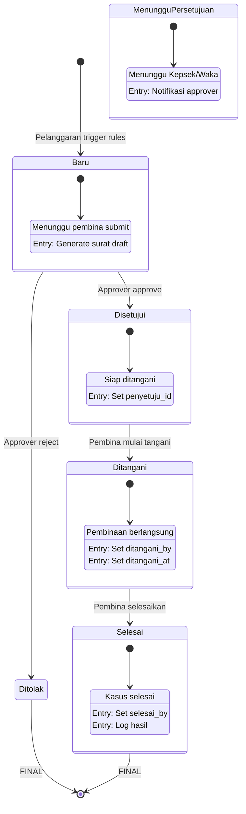
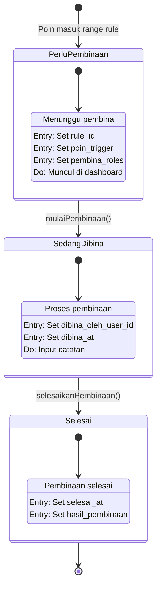
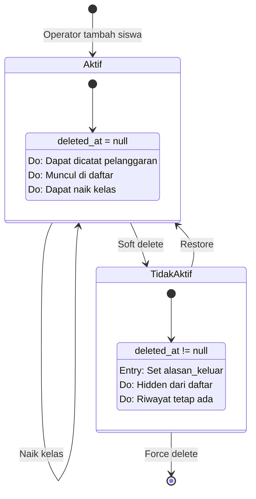
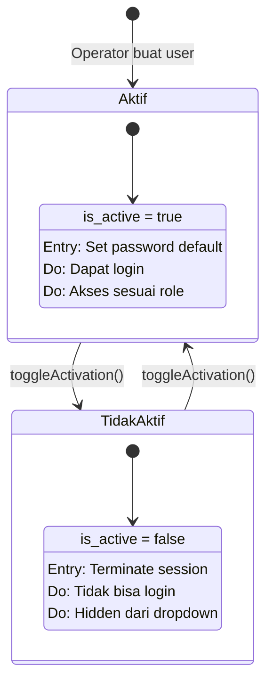
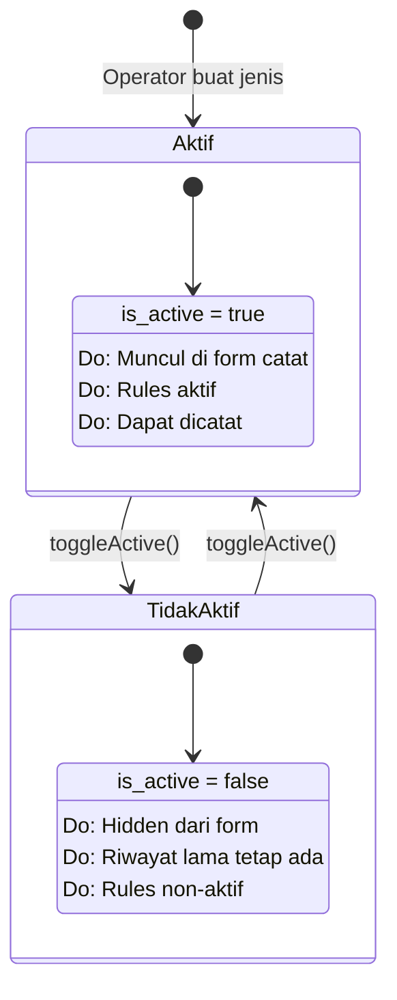
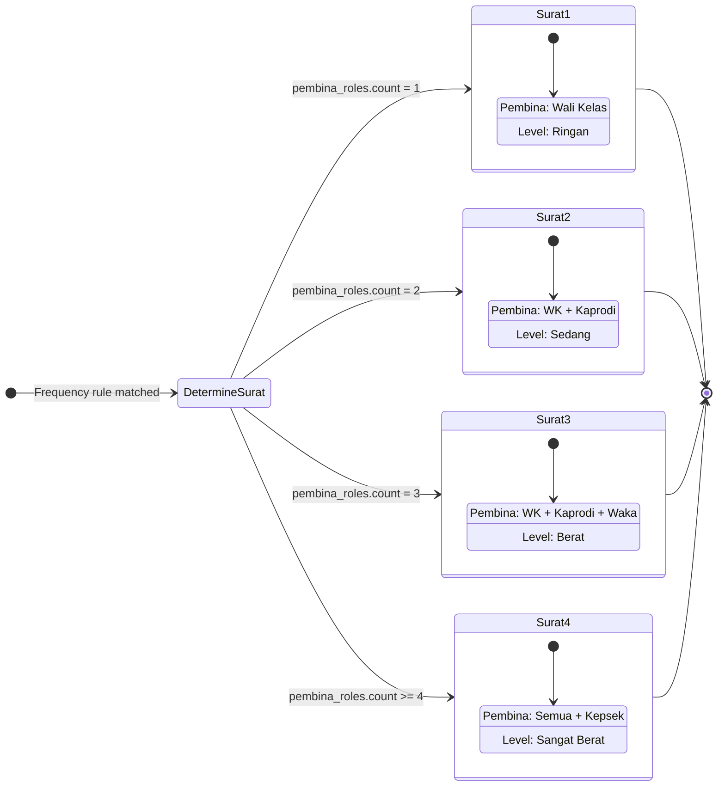
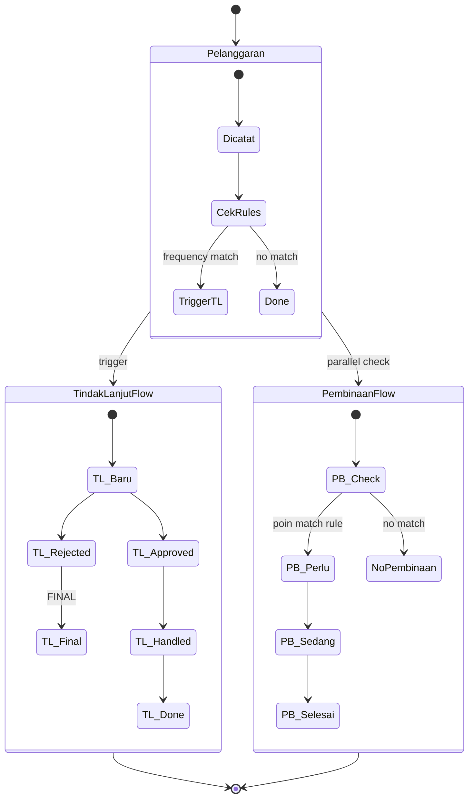

# 🔄 State Diagram

## Sistem Informasi Kedisiplinan Siswa SMK Negeri 1

### Deskripsi

State Diagram menggambarkan berbagai state (kondisi/status) dari entitas dalam sistem dan transisi yang dapat terjadi antar state.

---

## 1. State Diagram: Tindak Lanjut

---

## 2. State Diagram: Pembinaan Status

---

## 3. State Diagram: Siswa Lifecycle

---

## 4. State Diagram: User Activation

---

## 5. State Diagram: Jenis Pelanggaran

---

## 6. State Diagram: Tipe Surat Panggilan

---

## 7. Composite State: Alur Lengkap Sistem

---

## Ringkasan State

| Entitas          | States | Final State         | Keterangan             |
| ---------------- | ------ | ------------------- | ---------------------- |
| TindakLanjut     | 4      | Selesai / Ditolak   | Ditolak = FINAL        |
| PembinaanStatus  | 3      | Selesai             | Linear flow            |
| Siswa            | 2      | [End]               | Ya (Restore possible)  |
| User             | 2      | -                   | Ya (Toggle activation) |
| JenisPelanggaran | 2      | -                   | Ya (Toggle active)     |
| SuratPanggilan   | 4 tipe | Determined by rules | One-time determination |

---

**Dokumen ini menggunakan sintaks Mermaid.js**  
**Terakhir diupdate: 27 Desember 2024**
