# 🖥️ Deployment Diagram

## Sistem Informasi Kedisiplinan Siswa SMK Negeri 1

### Deskripsi

Deployment Diagram menggambarkan arsitektur fisik sistem, termasuk server, komponen, dan komunikasi antar node.

---

## 1. Development Environment (Laragon)

```mermaid
flowchart TB
    subgraph DevMachine["💻 DEVELOPER MACHINE (Windows)"]
        subgraph Laragon["🦎 Laragon Stack"]
            Apache["🌐 Apache 2.4\nPort 80"]
            PHP["⚙️ PHP 8.2"]
            MySQL["🗄️ MySQL 8.0\nPort 3306"]
            HeidiSQL["📊 HeidiSQL"]
        end

        subgraph IDE["🔧 Development Tools"]
            VSCode["📝 VS Code"]
            Terminal["💻 Terminal"]
            Artisan["🔨 php artisan"]
        end

        subgraph Frontend["🎨 Frontend Build"]
            NodeJS["📦 Node.js 20"]
            NPM["📦 npm"]
            Vite["⚡ Vite 7.x\nPort 5173"]
        end

        Browser["🌐 Browser\nlocalhost"]
    end

    Browser --> Apache
    Apache --> PHP
    PHP --> MySQL
    Vite --> Browser
    VSCode --> PHP
    Artisan --> MySQL
```

---

## 2. Production Environment (VPS)

```mermaid
flowchart TB
    subgraph Internet["🌍 INTERNET"]
        Users["👥 Users"]
        DNS["🌐 DNS\nsmkn1-kedisiplinan.sch.id"]
    end

    subgraph Firewall["🛡️ FIREWALL"]
        FW["iptables\nPort 80, 443, 22"]
    end

    subgraph VPS["🖥️ VPS SERVER (Ubuntu 22.04)"]
        subgraph WebServer["🌐 Web Server Layer"]
            Nginx["⚡ Nginx\nPort 80/443\nSSL Termination"]
        end

        subgraph AppServer["⚙️ Application Layer"]
            PHPFPM["PHP-FPM 8.2\nSocket: /run/php/php8.2-fpm.sock"]
            Laravel["🔴 Laravel 12\n/var/www/kedisiplinan"]
            Queue["📬 Queue Worker\nLaravel Horizon"]
            Scheduler["⏰ Cron Scheduler\n* * * * * php artisan schedule:run"]
        end

        subgraph DataLayer["🗄️ Data Layer"]
            MariaDB["🗄️ MariaDB 10.11\nPort 3306\nDB: smkn1_kedisiplinan"]
            Redis["📦 Redis\nPort 6379\nSession & Cache"]
        end

        subgraph Storage["💾 Storage"]
            Uploads["📁 /storage/app/public\nBukti Foto"]
            PDFs["📄 /storage/app/surat\nSurat Panggilan PDF"]
            Logs["📝 /storage/logs\nApplication Logs"]
        end
    end

    subgraph SSL["🔒 SSL/TLS"]
        LetsEncrypt["🔐 Let's Encrypt\nAuto-renewal"]
    end

    Users --> DNS
    DNS --> FW
    FW --> Nginx
    Nginx --> PHPFPM
    PHPFPM --> Laravel
    Laravel --> MariaDB
    Laravel --> Redis
    Laravel --> Uploads
    Laravel --> PDFs
    LetsEncrypt --> Nginx
    Queue --> MariaDB
    Scheduler --> Laravel
```

---

## 3. Shared Hosting Environment

```mermaid
flowchart TB
    subgraph Internet["🌍 INTERNET"]
        Users["👥 Users"]
    end

    subgraph SharedHost["🏢 SHARED HOSTING (cPanel)"]
        subgraph WebLayer["🌐 Web Layer"]
            LiteSpeed["⚡ LiteSpeed\nPort 80/443"]
            SSL["🔐 AutoSSL"]
        end

        subgraph AppLayer["⚙️ Application"]
            PHPHandler["PHP 8.2\nLiteSpeed SAPI"]
            PublicHtml["📁 public_html/\n(Laravel public/)"]
            AppDir["📁 ~/kedisiplinan/\n(Laravel root)"]
        end

        subgraph Database["🗄️ Database"]
            MySQLShared["MySQL 8.0\nlocalhost:3306"]
        end

        subgraph Storage["💾 Storage"]
            StorageLink["🔗 storage → public_html/storage"]
        end

        subgraph Tools["🔧 Tools"]
            Cron["⏰ Cron Jobs\ncPanel Scheduler"]
            FileManager["📂 File Manager"]
            PHPMyAdmin["🔧 phpMyAdmin"]
        end
    end

    Users --> LiteSpeed
    SSL --> LiteSpeed
    LiteSpeed --> PHPHandler
    PHPHandler --> PublicHtml
    PublicHtml --> AppDir
    AppDir --> MySQLShared
    AppDir --> StorageLink
    Cron --> AppDir
```

---

## 4. Component Diagram (Arsitektur Aplikasi)

```mermaid
flowchart TB
    subgraph Presentation["🎨 PRESENTATION LAYER"]
        Blade["📄 Blade Views\n50+ templates"]
        Tailwind["🎨 TailwindCSS 4"]
        Alpine["⚡ Alpine.js 3"]
        Lucide["🎯 Lucide Icons"]
    end

    subgraph Application["⚙️ APPLICATION LAYER"]
        subgraph Controllers["📁 Controllers"]
            Dashboard["Dashboard (7)"]
            MasterData["MasterData (4)"]
            Pelanggaran["Pelanggaran (2)"]
            Pembinaan["Pembinaan (1)"]
            Report["Report (3)"]
            Rules["Rules (3)"]
        end

        subgraph Services["📁 Services"]
            UserSvc["UserService"]
            SiswaSvc["SiswaService"]
            PelanggaranSvc["PelanggaranService"]
            RulesEngine["RulesEngine"]
            TindakLanjutSvc["TindakLanjutService"]
        end

        subgraph Middleware["🔒 Middleware"]
            Auth["Auth Guard"]
            RoleCheck["Role Middleware"]
        end
    end

    subgraph Data["🗄️ DATA LAYER"]
        subgraph Models["📁 Models (16)"]
            User["User"]
            Siswa["Siswa"]
            TindakLanjut["TindakLanjut"]
            Pelanggaran["RiwayatPelanggaran"]
            PembinaanModel["PembinaanStatus"]
        end

        subgraph Repos["📁 Repositories (9)"]
            BaseRepo["BaseRepository"]
            SiswaRepo["SiswaRepository"]
            UserRepo["UserRepository"]
        end

        subgraph Support["📁 Support"]
            Observers["Observers (4)"]
            Enums["Enums (4)"]
            DTOs["DTOs (11)"]
        end
    end

    subgraph External["📦 EXTERNAL PACKAGES"]
        DomPDF["barryvdh/dompdf"]
        ActivityLog["spatie/activitylog"]
        LaravelData["spatie/laravel-data"]
    end

    Blade --> Controllers
    Controllers --> Services
    Controllers --> Middleware
    Services --> Models
    Services --> Repos
    Models --> Observers
    Services --> DomPDF
    Models --> ActivityLog
    Services --> LaravelData
```

---

## 5. Network Topology

```mermaid
flowchart LR
    subgraph school["🏫 SMK NEGERI 1"]
        subgraph lab["💻 Lab Komputer"]
            PC1["🖥️ PC 1"]
            PC2["🖥️ PC 2"]
            PCn["🖥️ PC N"]
        end

        subgraph office["🏢 Kantor"]
            Kepsek["💼 PC Kepsek"]
            TU["📋 PC TU"]
            Guru["👨‍🏫 PC Guru"]
        end

        subgraph mobile["📱 Mobile"]
            Phone1["📱 Wali Murid"]
            Phone2["📱 Guru"]
        end

        Router["📡 Router Sekolah"]
    end

    subgraph cloud["☁️ CLOUD"]
        CDN["🌐 CDN\nCloudflare"]
        VPS["🖥️ VPS Server"]
        Backup["💾 Backup Storage"]
    end

    PC1 --> Router
    PC2 --> Router
    PCn --> Router
    Kepsek --> Router
    TU --> Router
    Guru --> Router
    Phone1 --> Router
    Phone2 --> Router

    Router --> CDN
    CDN --> VPS
    VPS --> Backup
```

---

## Spesifikasi Server Minimum

### Development:

| Komponen | Minimum       | Rekomendasi |
| -------- | ------------- | ----------- |
| CPU      | 2 Core        | 4 Core      |
| RAM      | 4 GB          | 8 GB        |
| Storage  | 20 GB SSD     | 50 GB SSD   |
| OS       | Windows 10/11 | Windows 11  |

### Production (VPS):

| Komponen  | Minimum          | Rekomendasi      |
| --------- | ---------------- | ---------------- |
| CPU       | 2 vCPU           | 4 vCPU           |
| RAM       | 2 GB             | 4 GB             |
| Storage   | 40 GB SSD        | 80 GB SSD        |
| Bandwidth | 1 TB/bulan       | Unlimited        |
| OS        | Ubuntu 22.04 LTS | Ubuntu 22.04 LTS |

---

**Dokumen ini menggunakan sintaks Mermaid.js**  
**Terakhir diupdate: 27 Desember 2024**
