# 🧩 Component Diagram

## Sistem Informasi Kedisiplinan Siswa SMK Negeri 1

### Deskripsi

Component Diagram menggambarkan struktur komponen dalam sistem, termasuk dependencies dan interfaces antar komponen.

---

## 1. Arsitektur Layer

```mermaid
flowchart TB
    subgraph Client["🌐 CLIENT LAYER"]
        Browser["🖥️ Web Browser"]
        Mobile["📱 Mobile Browser"]
    end

    subgraph Presentation["🎨 PRESENTATION LAYER"]
        direction TB
        subgraph Views["Blade Views"]
            Layouts["📄 layouts/app.blade.php"]
            Dashboard["📊 dashboard/*"]
            Pelanggaran["⚠️ pelanggaran/*"]
            TindakLanjut["📝 tindaklanjut/*"]
            MasterData["📋 masterdata/*"]
            Report["📈 report/*"]
        end

        subgraph Assets["Frontend Assets"]
            CSS["🎨 TailwindCSS 4"]
            JS["⚡ Alpine.js 3"]
            Icons["🎯 Lucide Icons"]
        end

        Vite["📦 Vite 7.x"]
    end

    subgraph Application["⚙️ APPLICATION LAYER"]
        direction TB
        subgraph HTTP["HTTP Layer"]
            Routes["🛣️ Routes"]
            Middleware["🔒 Middleware"]
            Controllers["🎮 Controllers"]
            Requests["✅ Form Requests"]
        end

        subgraph Business["Business Logic"]
            Services["🔧 Services"]
            RulesEngine["⚙️ Rules Engine"]
        end

        subgraph Support["Support"]
            DTOs["📦 DTOs"]
            Helpers["🔨 Helpers"]
        end
    end

    subgraph Data["🗄️ DATA LAYER"]
        direction TB
        subgraph ORM["Eloquent ORM"]
            Models["📊 Models (16)"]
            Observers["👁️ Observers (4)"]
            Enums["🏷️ Enums (4)"]
        end

        subgraph Repository["Repository Pattern"]
            Repos["📁 Repositories (9)"]
        end

        Database["🗄️ MySQL/MariaDB"]
        Cache["📦 Cache (Redis/File)"]
    end

    subgraph External["📦 EXTERNAL"]
        DomPDF["📄 DomPDF"]
        ActivityLog["📝 Spatie ActivityLog"]
        LaravelData["📊 Spatie Laravel Data"]
    end

    Browser --> Presentation
    Mobile --> Presentation
    Presentation --> Application
    Application --> Data
    Application --> External
    Vite --> Assets
```

---

## 2. Controller Components

```mermaid
flowchart TB
    subgraph Controllers["📁 app/Http/Controllers"]
        direction TB

        subgraph Dashboard["Dashboard/ (7)"]
            AdminDashboard["AdminDashboardController"]
            KepsekDashboard["KepsekDashboardController"]
            KaprodiDashboard["KaprodiDashboardController"]
            WaliKelasDashboard["WaliKelasDashboardController"]
            WakaSaranaDashboard["WakaSaranaDashboardController"]
            WaliMuridDashboard["WaliMuridDashboardController"]
            DeveloperDashboard["DeveloperDashboardController"]
        end

        subgraph MasterData["MasterData/ (4)"]
            SiswaController["SiswaController"]
            KelasController["KelasController"]
            JurusanController["JurusanController"]
            JenisPelanggaranController["JenisPelanggaranController"]
        end

        subgraph Pelanggaran["Pelanggaran/ (2)"]
            RiwayatController["RiwayatPelanggaranController"]
            TindakLanjutController["TindakLanjutController"]
        end

        subgraph Pembinaan["Pembinaan/ (1)"]
            PembinaanController["PembinaanStatusController"]
        end

        subgraph Report["Report/ (3)"]
            ReportController["ReportController"]
            ApprovalController["ApprovalController"]
            SiswaPerluPembinaan["SiswaPerluPembinaanController"]
        end

        subgraph Rules["Rules/ (3)"]
            FrequencyRulesController["FrequencyRulesController"]
            PembinaanRulesController["PembinaanInternalRulesController"]
            SettingsController["RulesEngineSettingsController"]
        end

        UserController["UserController"]
    end
```

---

## 3. Service Components

```mermaid
flowchart TB
    subgraph Services["📁 app/Services"]
        direction TB

        subgraph MasterDataSvc["MasterData/"]
            JenisPelanggaranService["JenisPelanggaranService"]
            JurusanService["JurusanService"]
            JurusanStatistics["JurusanStatisticsService"]
            KelasService["KelasService"]
            KelasStatistics["KelasStatisticsService"]
        end

        subgraph PelanggaranSvc["Pelanggaran/"]
            PelanggaranPreview["PelanggaranPreviewService"]
            PelanggaranRulesEngine["PelanggaranRulesEngine"]
            PelanggaranService["PelanggaranService"]
            SuratPanggilanService["SuratPanggilanService"]
        end

        subgraph RulesSvc["Rules/"]
            FrequencyRuleService["FrequencyRuleService"]
            RulesEngineSettings["RulesEngineSettingsService"]
        end

        subgraph TindakLanjutSvc["TindakLanjut/"]
            TindakLanjutService["TindakLanjutService"]
        end

        subgraph UserSvc["User/"]
            RoleService["RoleService"]
            UserNamingService["UserNamingService"]
            UserService["UserService"]
        end
    end

    subgraph Dependencies["Dependencies"]
        DomPDF["📄 DomPDF"]
        Database["🗄️ Eloquent"]
        Cache["📦 Cache"]
    end

    PelanggaranRulesEngine --> FrequencyRuleService
    PelanggaranRulesEngine --> TindakLanjutService
    TindakLanjutService --> SuratPanggilanService
    SuratPanggilanService --> DomPDF

    JurusanService --> UserService
    KelasService --> UserService
```

---

## 4. Data Layer Components

---

## 5. Routes Components

```mermaid
flowchart LR
    subgraph Routes["📁 routes/"]
        direction TB

        WebRoutes["🌐 web.php\nAuth, Dashboard"]

        subgraph DomainRoutes["Domain Routes"]
            SiswaRoutes["👤 siswa.php"]
            PelanggaranRoutes["⚠️ pelanggaran.php"]
            TindakLanjutRoutes["📝 tindak_lanjut.php"]
            PembinaanRoutes["🎓 pembinaan.php"]
            UserRoutes["👥 user.php"]
            MasterDataRoutes["📋 master_data.php"]
            ReportRoutes["📈 report.php"]
            AdminRoutes["⚙️ admin.php"]
        end

        DeveloperRoutes["🔧 developer.php"]
    end

    subgraph Middleware["🔒 Middleware"]
        Auth["auth"]
        Guest["guest"]
        RoleMiddleware["role:Admin,Operator"]
    end

    WebRoutes --> SiswaRoutes
    WebRoutes --> PelanggaranRoutes
    WebRoutes --> TindakLanjutRoutes
    WebRoutes --> PembinaanRoutes
    WebRoutes --> UserRoutes
    WebRoutes --> MasterDataRoutes
    WebRoutes --> ReportRoutes
    WebRoutes --> AdminRoutes

    Routes --> Middleware
```

---

## 6. External Package Dependencies

---

## Ringkasan Komponen

| Layer        | Komponen      | Jumlah | Deskripsi                |
| ------------ | ------------- | ------ | ------------------------ |
| Presentation | Blade Views   | 50+    | UI Templates             |
| Presentation | CSS/JS Assets | 3      | Tailwind, Alpine, Lucide |
| Application  | Controllers   | 17     | Request handlers         |
| Application  | Services      | 19     | Business logic           |
| Application  | Form Requests | 15+    | Validation               |
| Application  | Repositories  | 9      | Data access              |
| Data         | Models        | 16     | Database entities        |
| Data         | Observers     | 4      | Model events             |
| Data         | Enums         | 4      | Status constants         |
| External     | PHP Packages  | 4      | DomPDF, Spatie, etc.     |
| External     | NPM Packages  | 4      | Vite, Tailwind, etc.     |

---

**Dokumen ini menggunakan sintaks Mermaid.js**  
**Terakhir diupdate: 27 Desember 2024**
